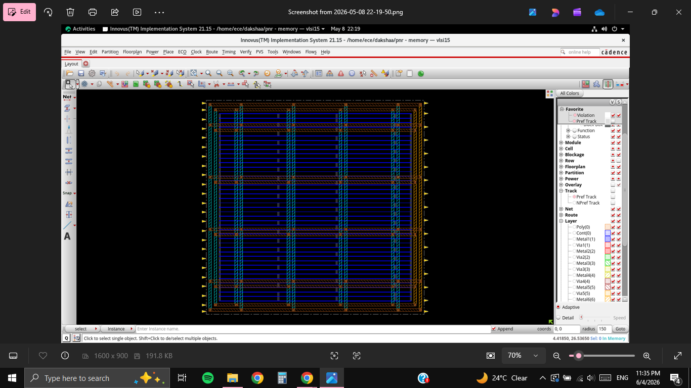

# RTL-to-GDSII Implementation of a Synchronous Memory Block using Cadence Innovus (90nm)

## Project Overview

This project demonstrates the complete ASIC Physical Design flow for a synchronous memory block using **Cadence Innovus 21.15** on a **90nm CMOS technology node**.

The implementation begins with a synthesized gate-level netlist generated using Cadence Genus and progresses through all major backend design stages:

- Floorplanning
- Power Planning
- Placement
- Clock Tree Synthesis (CTS)
- Post-CTS Optimization
- Routing
- Physical Verification
- GDSII Stream-Out

The objective was to achieve **timing closure with zero violations** while maintaining clean physical verification results — zero DRC violations, zero connectivity violations, and zero power-grid shorts. All goals were met at the worst-case process corner (SS, 0.9V, 125°C).

---

## Design Specifications

| Parameter           | Value                          |
|---------------------|--------------------------------|
| Design Name         | memory                         |
| Design Type         | Synchronous Memory Block       |
| Technology Node     | 90nm                           |
| Supply Voltage      | 0.9V                           |
| Temperature         | 125°C (worst-case)             |
| PVT Corner          | PVT_0P9V_125C (Slow-Slow)      |
| Implementation Tool | Cadence Innovus 21.15-s110_1   |
| Synthesis Tool      | Cadence Genus                  |
| OS                  | Linux x86_64 (Host: vlsi15)    |
| Metal Layers Used   | M1–M6                          |
| Analysis Mode       | MMMC (Non-OCV)                 |
| Setup View          | func_ss                        |
| Hold View           | func_ff                        |
| Die Boundary        | (0.0, 0.0) to (83.6, 82.08) µm |

---

## Final Results at a Glance

| Metric                    | Value            | Status|
|---------------------------|------------------|------|
| WNS (setup, all modes)    | 0.927 ns         | PASS |
| TNS                       | 0.000 ns         | PASS |
| Violating paths           | 0                | PASS |
| Hold violations           | 0                | PASS |
| Clock skew                | 0.015 ns         | PASS |
| Max clock latency         | 0.179 ns         | PASS |
| DRC violations            | 0                | PASS |
| PG short violations       | 0                | PASS |
| Connectivity violations   | 0                | PASS |
| Routing overflow          | 0.00% H, 0.00% V | PASS |
| Max transition            | 0.280 ns         | PASS |
| Final cell density        | 61.335%          |      |

---

## Physical Design Flow

```
Synthesized Netlist (Cadence Genus)
           │
           ▼
   1. Design Setup & Import
      └─ LEF, LIB, SDC, MMMC config
           │
           ▼
   2. Floorplanning
      └─ Core area, I/O pins, row definition
           │
           ▼
   3. Power Planning
      └─ VDD/VSS rings and stripes
           │
           ▼
   4. Placement  (GigaPlace)
      └─ Timing-driven, DRV optimization
      └─ WNS: 0.804 ns | Density: 53.25% | Overflow: 0%
           │
           ▼
   5. Clock Tree Synthesis  (CCOpt)
      └─ Skew: 0.015 ns | Max latency: 0.179 ns
           │
           ▼
   6. Post-CTS Optimization
      └─ Setup + hold fixing → 0 violations
      └─ WNS: 1.407 ns (post-CTS, pre-route)
           │
           ▼
   7. Routing  (NanoRoute)
      └─ 2664 nets routed | Overflow: 0.00%
           │
           ▼
   8. Physical Verification
      └─ DRC: 0 | PG shorts: 0 | Connectivity: 0
           │
           ▼
   9. GDSII Stream-Out
      └─ final.gds → ~/pnr/outputs/
```

---

## Stage-by-Stage Details

### 1. Design Setup and Import

The synthesized gate-level netlist from Cadence Genus was imported into Innovus along with technology files and timing constraints.

**Inputs loaded:**
- Gate-level netlist (memory.v)
- Standard cell LEF and technology LEF
- Timing libraries (LVT cell variants)
- SDC constraints
- MMMC view definition (func_ss for setup, func_ff for hold)

**Design properties confirmed via `report_design`:**

| Property              | Value            |
|-----------------------|------------------|
| Operating condition   | PVT_0P9V_125C    |
| Process               | 1.000 (nominal)  |
| Voltage               | 0.900 V          |
| Temperature           | 125.000°C        |
| Tree type             | worst_case       |
| Max transition        | 0.280 ns         |

---

### 2. Floorplanning

The core boundary and placement area were defined. I/O pins were placed along the die edges and standard cell rows were generated.

**Activities:**
- Core area and die boundary definition
- Standard cell row generation across the placement region
- I/O pin placement on all four die edges (visible as yellow arrows in layout)
- Aspect ratio and utilization target set to maintain routing headroom

**Output:** Clean initial floorplan with uniform placement rows and congestion-free routing channels.

---

### 3. Power Planning

A power delivery network was created using rings around the core periphery and internal stripes across the standard-cell rows.

**Structures created:**
- VDD and VSS power rings around the core boundary
- Internal power stripes for reliable IR drop distribution across all standard-cell rows

**Verification:** `power_plan_done.enc.dat` generated with **0 warnings, 0 errors**.

---

### 4. Placement

Standard cell placement was performed using the Cadence **GigaPlace** engine with timing-driven optimization enabled. Three DrvOpt passes were run to reduce design rule violations before CTS.

**Command:** `place_opt_design`

#### Pre-CTS Timing Results (after placement optimization)

| Analysis Mode | WNS (ns) | TNS (ns) | Violating Paths |
|---------------|----------|----------|-----------------|
| all           | 0.804    | 0.000    | 0               |
| reg2reg       | 2.259    | 0.000    | 0               |
| default       | 0.804    | 0.000    | 0               |

#### Design Rule Violations (post-placement)

| DRV Type   | Real Nets (terms) | Worst Violation | Total Nets |
|------------|-------------------|-----------------|------------|
| max_cap    | 0 (0)             | 0.000           | 0 (0)      |
| max_tran   | 0 (0)             | 0.000           | 0 (0)      |
| max_fanout | 0 (0)             | 0               | 1 (1)      |
| max_length | 0 (0)             | 0               | 0 (0)      |

> **Note on clock fanout:** Before CTS, `clk_i` drives 273 loads against a maximum fanout of 25. This is flagged as remark **C** (clock net — not fixable pre-CTS, 0 real violations). It is fully resolved by CTS buffer insertion. This is expected and correct behavior.

#### Placement Metrics

| Metric           | Value   |
|------------------|---------|
| Cell density     | 53.253% |
| Routing overflow | 0.00% H and 0.00% V |
| Total paths      | 290 (272 reg2reg) |

**Timing reports saved to:** `./reports/placement/preCTS.*`

---

### 5. Clock Tree Synthesis (CTS)

CTS was performed using the Cadence **CCOpt** engine targeting the `mclk` clock domain. A balanced two-level buffer tree was synthesized to minimize skew and insertion delay across all sequential elements.

**Clock specification:** `cts.tcl`

**Buffer cells inserted:** `CLKBUFX6LVT`, `CLKBUFX2LVT`, `CLKBUFX3LVT`

**Clock tree structure:**
```
clk_i (source)
    └── Root buffer (CLKBUFX6LVT)
            ├── Intermediate buffers (CLKBUFX2LVT / CLKBUFX3LVT)
            │       ├── Leaf flip-flops (mem_reg, rdata_o_reg, ...)
            │       └── ...
            └── ...
```

#### CTS Results

| Metric          | Value                        |
|-----------------|------------------------------|
| Clock skew      | **0.015 ns**                 |
| Max latency     | **0.179 ns** (mem_reg[11][2]/CK) |
| Min latency     | 0.164 ns (rdata_o_reg[12]/CK) |
| Clock domain    | mclk                         |
| Analysis view   | func_ss                      |

**Clock latency path (max latency — 0.179 ns):**

| Instance              | Arc     | Cell         | Delay (ns) | Clock Latency (ns) |
|-----------------------|---------|--------------|------------|-------------------|
| —                     | clk_i ↑ | —            | —          | 0.022             |
| CTS_ccl_a_buf_00037   | A→Y ↑   | CLKBUFX6LVT  | 0.074      | 0.096             |
| CTS_ccl_a_buf_00006   | A→Y ↑   | CLKBUFX2LVT  | 0.083      | 0.179             |
| mem_reg[11][2]        | CK ↑    | DFFQXLLVT   | 0.000      | 0.179             |

**Clock skew path (0.015 ns between launch and capture):**

| Clock Pin              | Latency (ns) | Role    |
|------------------------|--------------|---------|
| mem_reg[6][12]/CK      | 0.178        | Launch  |
| rdata_o_reg[12]/CK     | 0.164        | Capture |
| **Skew**               | **0.015**    |         |

---

### 6. Post-CTS Optimization

Two optimization passes were run after CTS to fix hold violations and improve setup slack.

**Commands used:**
```tcl
optDesign -postCTS        # setup optimization
optDesign -postCTS -hold  # hold violation fixing
```

#### Hold Fix Results

| Metric          | Before Opt | After Opt |
|-----------------|------------|-----------|
| Hold violations | 3          | **0**     |
| Hold WNS        | -0.000 ns  | 0.000 ns  |

#### Post-CTS Timing Summary (after both passes)

| Analysis Mode | WNS Setup (ns) | TNS (ns) | Violating Paths |
|---------------|----------------|----------|-----------------|
| all           | 1.407          | 0.000    | 0               |
| reg2reg       | 2.366          | 0.000    | 0               |
| all (hold)    | 0.000          | 0.000    | 0               |

**Cell density after optimization:** 61.335%

---

### 7. Routing

Detailed routing was performed using the Cadence **NanoRoute** engine. All nets were successfully routed across Metal1–Metal6 with zero overflow.

**Command:** `routeDesign`

#### Routing Results

| Metric                     | Value         |
|----------------------------|---------------|
| Nets routed                | 2664          |
| Routing overflow (H)       | 0.00%         |
| Routing overflow (V)       | 0.00%         |
| Open nets                  | 0             |
| Metal layers used          | M1 – M6       |
| Via layers                 | Via1 – Via5   |

#### Post-Route Timing

| Analysis Mode | WNS (ns) | TNS (ns) | Violating Paths |
|---------------|----------|----------|-----------------|
| all (setup)   | 0.927    | 0.000    | 0               |
| reg2reg       | 2.300    | 0.000    | 0               |
| all (hold)    | 0.000    | 0.000    | 0               |

> **Why does setup WNS decrease from 1.407 ns (post-CTS) to 0.927 ns (post-route)?** Post-route timing uses actual extracted RC parasitics, which are more pessimistic than the virtual wire models used during placement and CTS. The slack reduction is expected and the design remains timing-clean with 0 violations.

---

### 8. Physical Verification

Three signoff checks were run after routing. All passed with zero violations.

#### DRC — `verify_drc -limit 0`

```
VERIFY DRC ...... Verification Complete
Sub-Area: {0.000 0.000 83.600 82.080} 1 of 1
Result: 0 Violations  
```

#### PG Short — `verify_PG_short`

```
VERIFY PG SHORT ...... Short: 0 Viols.
Verification Complete: 0 Short Viols.  
```

#### Connectivity — `verifyConnectivity`

```
Begin Summary
  Found no problems or warnings.
End Summary
Verification Complete: 0 Viols. 0 Wrngs.  
```

#### Verification Summary

| Check        | Command              | Result     |
|--------------|----------------------|------------|
| DRC          | verify_drc           | 0 violations |
| PG Shorts    | verify_PG_short      | 0 violations |
| Connectivity | verifyConnectivity   | 0 violations |

---

### 9. GDSII Stream-Out

Following successful physical verification and timing closure, the final layout was exported as a GDSII stream file.

| Parameter      | Value                          |
|----------------|--------------------------------|
| Output file    | `final.gds`                    |
| Output path    | `~/dakshaa/pnr/outputs/`       |
| Design name    | memory                         |
| Database units | 2000                           |
| Die dimensions | 83.6 µm × 82.08 µm             |


## Screenshots

### Floorplan + Power Plan
Core area defined with power rings and stripes. Blue horizontal lines are routing tracks; orange boundary is the power ring.



### Placement — Global View
Standard cells placed across the core. Density: 53.25%. Zero routing overflow.


### Placement — Zoomed
Individual standard cell instances: `mem_reg`, `rdata_o_reg`, combinational logic cells.


### Post-CTS Layout
Clock buffer instances (`CTS_ccl_a_buf_*`) inserted by Innovus visible across the core.


### Clock Tree Debugger
Balanced two-level clock tree. Root buffer fans out to all leaf flip-flops. Skew: 0.015 ns.


### Routed Layout — Global
Fully routed design. All six metal layers (M1–M6) and via layers (Via1–Via5) visible.


### Routed Layout — Zoomed
Detailed routing showing M1 horizontal routes and M2 vertical routes with via connections.


### Physical Verification — Clean
`verify_drc`: 0 violations | `verify_PG_short`: 0 shorts | `verifyConnectivity`: 0 violations.


### GDSII Output
`final.gds` generated in `~/dakshaa/pnr/outputs/`. Binary GDSII stream containing full layout geometry.


---

## Tools and Technologies

| Category           | Details                                              |
|--------------------|------------------------------------------------------|
| Implementation     | Cadence Innovus 21.15-s110_1                         |
| Synthesis          | Cadence Genus                                        |
| Placement engine   | GigaPlace (timing-driven)                            |
| CTS engine         | CCOpt                                                |
| Routing engine     | NanoRoute                                            |
| Scripting          | Tcl, Linux bash                                      |
| Process node       | 90nm CMOS                                            |
| Standard cell libs | LVT variants (DFFQXLLVT, CLKBUFX6LVT, NAND4XLLVT…) |
| Timing methodology | MMMC — func_ss (setup) / func_ff (hold)              |
| Signoff checks     | verify_drc, verify_PG_short, verifyConnectivity      |

---

## Key Learnings

- **End-to-end PD flow:** Executed the complete RTL-to-GDSII backend implementation flow in an industry-standard EDA environment
- **Timing closure:** Understood the difference between pre-CTS virtual wire timing and post-route parasitic-extracted timing, and why WNS changes between stages
- **CTS methodology:** Hands-on experience with clock buffer insertion, skew targeting, and latency reporting using `report_clock_timing`
- **Hold fixing:** Applied two-pass post-CTS optimization (setup first, then hold) to achieve zero violations in both modes
- **Power planning:** Designed ring + stripe power topology for reliable VDD/VSS delivery
- **Physical verification:** Ran and interpreted DRC, PG short, and connectivity signoff checks
- **Tcl scripting:** Automated all major flow stages using Innovus Tcl commands
- **Linux EDA workflow:** Operated the full flow from the Linux terminal using command-line EDA tools

---

## Acknowledgements

This project was completed as part of a Physical Design Training Program at **Nitte Meenakshi Institute of Technology (NMIT), Bengaluru**.

Special thanks to:
- Dr. Sowmya Madhavan (Head of Department)
- Dr. Naveen I.G.
- Dr. Shashidhar K.S.
- VLSI Minds

for providing the infrastructure, guidance, and opportunity to gain hands-on experience in ASIC Physical Design.

---

## About

Third-year B.E. Electronics (VLSI Design and Technology) student at NMIT Bengaluru | CGPA: 9.5 | Targeting ASIC Physical Design roles.

---

*Tags: `vlsi` `physical-design` `cadence-innovus` `eda` `rtl-to-gdsii` `asic` `floorplanning` `cts` `timing-closure` `gdsii` `90nm`*
